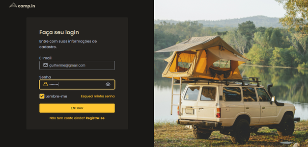
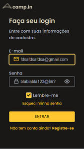

<h1 align='center'>Login Form Layout</h1>

  <a href="#-sobre">Sobre</a>&nbsp;&nbsp;&nbsp;|&nbsp;&nbsp;&nbsp;
  <a href="#-layout">Layout</a>&nbsp;&nbsp;&nbsp;|&nbsp;&nbsp;&nbsp;
  <a href="#-tecnologias-e-ferramentas">Tecnologias e Ferramentas</a>&nbsp;&nbsp;&nbsp;|&nbsp;&nbsp;&nbsp;
  <a href="#-licença">Licença</a>&nbsp;&nbsp;&nbsp;|&nbsp;&nbsp;&nbsp;

🚀 Projeto concluído ✅

## 💻 Sobre

Este projeto é um página web simples feita em HTML, CSS e JavaScript com design customizado de formulário de login. O projeto é mais um desafio do curso Discover da Rocketseat. Link para [página do desafio](https://efficient-sloth-d85.notion.site/Desafio-Login-Form-CSS-a10caea5a183494e97eb9ce4f33536b3). 

Clique [aqui](https://gustavo-victor.github.io/login-form-layout/) para conferir como ficou o projeto no Github pages

## 📷 Layout

 

Você pode visualizar o [template do projeto](https://www.figma.com/file/qjRkY9SVeHZ08YU4a2PCxm/DD-Login-Form-CSS-Copy?fuid=1197220564085998057) no Figma

## 🛠 Tecnologias e Ferramentas

- Linguagens: 
    - [HTML](https://developer.mozilla.org/pt-BR/docs/Web/HTML) 
    - [CSS](https://developer.mozilla.org/pt-BR/docs/Web/CSS)
    - [Javascript](https://www.javascript.com/)
- Ferramentas / Recursos: 
    - Editor: [Visual Studio Code](https://code.visualstudio.com/)
    - Fontes: [Poppins](https://fonts.google.com/specimen/Poppins?query=Poppins)

## 📝 Licença 

O projeto está sob a [Licensa MIT](./LICENSE) 

Qualquer pessoa pode usar, clonar e contribuir com este projeto 👍😁 

